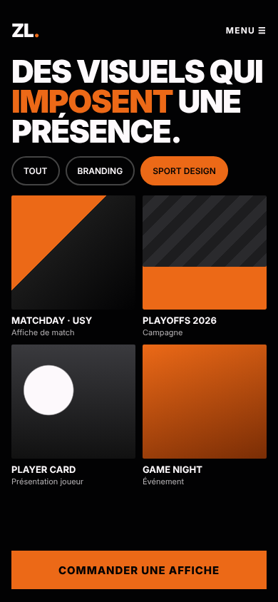
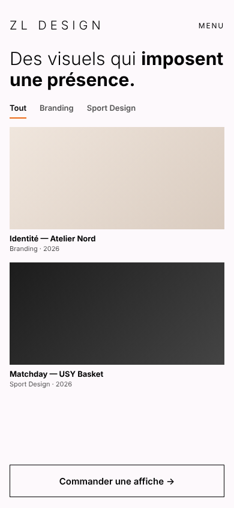
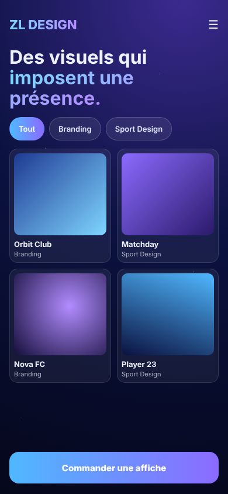

# Critique comparative des propositions de design

Les 3 propositions de l’écran Accueil / Portfolio ont été générées avec une IA (Claude) à partir de [brief.md](../brief.md) et des wireframes. Images : `design/propositions/`.

## Proposition A — « Matchday »

- **Points forts :** colle à l’ambiance du brief (« comme une affiche de match »), titre très impactant, couleurs de la marque ZL (noir + orange), filtre actif bien visible, gros bouton orange facile au pouce. Contraste : orange sur noir 6,5:1, blanc sur noir 19,9:1 → WCAG AA respecté.
- **Points faibles :** les majuscules partout fatiguent à la lecture, le titre prend beaucoup de place, ce qui pousse les réalisations plus bas.

## Proposition B — « Galerie »

- **Points forts :** très lisible, élégant, met en valeur le Branding. Contraste excellent (texte gris 7,1:1).
- **Points faibles :** trop calme pour du sport design, une seule colonne donc seulement 2 réalisations visibles, l’orange est presque absent, le bouton principal ne ressort pas assez. Ne correspond pas à « audacieuse, sportive ».

## Proposition C — « Galaxie »

- **Points forts :** original et moderne, effet premium, cartes bien séparées.
- **Points faibles :** ne reprend pas les couleurs ZL Design, dégradés et étoiles chargés sur un petit écran. Le bouton échoue au contraste WCAG AA (blanc sur bleu clair 2,2:1). Ressemble à une app tech plus qu’à une app sport.

## Tableau

| Critère | A Matchday | B Galerie | C Galaxie |
|---|---|---|---|
| Respect de l’ambiance du brief | ✅ | ❌ | ⚠️ |
| Identité ZL Design (noir / orange) | ✅ | ⚠️ | ❌ |
| Contraste WCAG AA | ✅ | ✅ | ❌ |
| Bouton principal visible (48 px +) | ✅ | ⚠️ | ✅ |
| Réalisations visibles sans scroller | 4 | 2 | 4 |

## Choix final : Proposition A — « Matchday »

C’est celle qui répond le mieux au persona (Marc veut voir des exemples sport et commander vite) et à la direction artistique : audacieuse, premium, sportive.

**Corrections à apporter :**
1. Majuscules seulement pour le titre et les boutons, texte courant en minuscules.
2. Titre un peu plus petit pour afficher les réalisations plus haut.
3. Reprendre la mise en page aérée de B pour la fiche réalisation et les formulaires.
