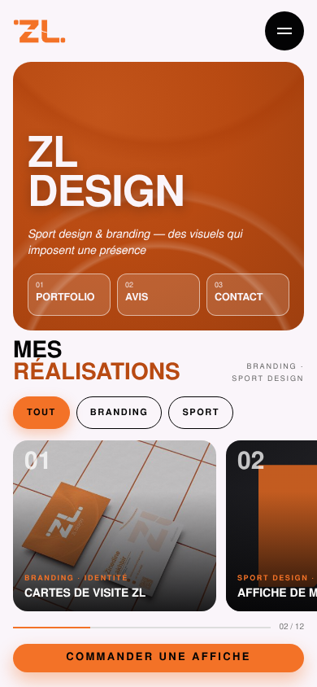

# Tests utilisateurs & audit d'accessibilité — e2-7

**App testée :** ZL DESIGN (proposition A « Matchday », `design/propositions/proposition-A-matchday.png`)
**Testeur :** Marlon Pavid
**Observateur :** Zinedine Lakhbir
**Tâche donnée :** « Où cliqueriez-vous pour commander une affiche ? »

## Test 5 secondes

« C'est une appli pour… » (phrase du testeur) : « C'est une appli pour présenter et commander des créations graphiques personnalisées, comme des affiches et des cartes de visite. »

Écart avec l'intention : faible. Le testeur a compris « portfolio + commande ». Par contre, il n'a pas vu que l'app est spécialisée **sport design et branding** : le mot « sport » ne ressort pas au premier coup d'œil.

## Test de localisation (sur image — une tâche)

Consigne dite : « Montrez où vous tapoteriez pour : commander une affiche »

Le doigt est allé au **bon** contrôle : oui (bouton orange « COMMANDER UNE AFFICHE » en bas)
Hésitation : légère. Il a aussi remarqué le bouton « 02 COMMANDER » dans le bandeau orange : deux boutons pour la même action.
Dit à voix haute : « J'ai repéré ce bouton en bas, car il indique clairement l'action. J'ai aussi remarqué COMMANDER dans la section principale, mais le bouton du bas est plus explicite puisqu'il mentionne directement l'affiche. »
Temps : environ 2 à 3 secondes (estimé par le testeur, test fait à distance par message)
J'ai aidé : non

## Audit d'accessibilité (WCAG 2.2 AA)

### Contrastes de la palette

| Élément | Couleurs | Ratio | Exigé | Résultat |
|---|---|---|---|---|
| Texte courant | noir #030304 sur fond #FAF5FA | 19,15:1 | 4,5:1 | ✅ |
| Texte secondaire | gris #666666 sur fond #FAF5FA | 5,33:1 | 4,5:1 | ✅ |
| Étiquettes des cartes | orange #F37227 sur noir #030304 | 7,11:1 | 4,5:1 | ✅ |
| **Bouton principal « Commander une affiche »** | blanc #FAF5FA sur orange #F37227 | **2,69:1** | 4,5:1 | ❌ |
| Grand titre « ZL DESIGN » (52 px gras) | blanc #FAF5FA sur orange #F37227 | 2,69:1 | 3:1 | ❌ |
| Titre « RÉALISATIONS » (28 px gras) | orange #F37227 sur fond #FAF5FA | 2,69:1 | 3:1 | ❌ |

### Navigation au clavier

Testée sur la page en ligne (`index.html`, GitHub Pages) avec Tab / Entrée :

- Les 2 liens (« Voir mon GitHub », « Mon portfolio ») sont atteints dans l'ordre avec Tab. ✅
- Le focus est visible : le bouton passe en orange avec texte noir. ✅
- Les boutons font 50 px de haut (≥ 48 px). ✅

## 2 correctifs prioritaires

1. **Bouton principal :** texte **noir #030304** sur orange #F37227 → ratio **7,11:1** (au lieu de 2,69:1).
2. **Titres orange sur fond clair :** passer à l'orange foncé **#B84A12** → ratio **4,84:1** (au lieu de 2,69:1).

## 1 changement que je ferai (suite au test)

Avant : deux boutons différents pour commander (« 02 COMMANDER » dans le bandeau et « COMMANDER UNE AFFICHE » en bas), et le mot « sport » absent de l'accroche.
Après (prévu) : un seul libellé partout, « Commander une affiche », et l'accroche devient « Sport design & branding — des visuels qui imposent une présence ».

## Itération : proposition A v2

Corrections appliquées après l'audit et le test de Marlon :

| Problème | Avant | Après (v2) |
|---|---|---|
| Contraste du bouton principal | blanc sur orange, 2,69:1 | texte noir sur orange, **7,11:1** ✅ |
| Contraste du bandeau | blanc sur orange clair, 2,69:1 | bandeau orange foncé #B84A12, **4,84:1** ✅ |
| Titre « RÉALISATIONS » | orange #F37227, 2,69:1 | orange foncé #B84A12, **4,84:1** ✅ |
| Puce de filtre active | texte blanc sur orange | texte noir sur orange, **7,11:1** ✅ |
| Deux boutons « Commander » | « 02 COMMANDER » + « COMMANDER UNE AFFICHE » | un seul : « Commander une affiche » (le 02 devient « Avis ») |
| « Sport » invisible | « Des visuels qui imposent une présence » | « Sport design & branding — des visuels qui imposent une présence » |
